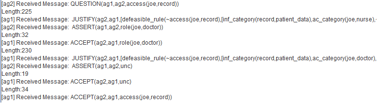

## Experimental Evaluation 

In this section, we show our results for the Enthymeme-based Communication Framework based on the scenario published in [1], 
describing the use of argumentation scheme for data access control. 

### Scenario for Data Access Control

In our first scenario, we illustrate an emergency situation that requires sharing data between two different hospitals.
In our scenario, a patient named **Bob** is being monitored and receiving treatment in a hospital **H1** located in Brazil. 
**Bob** decides to travel to the UK, receiving a bracelet that informs how to contact **H1** in case of emergency.

During the time **Bob** is staying in the UK, **Bob** starts to feel a strong pain in the chest, becomes unconscious, 
and goes to hospital **H2** located in the UK.

As **Bob** is unconscious (it seems an emergency situation), a doctor named **Joe** of **H2** calls **H1** 
in order to know the patient record.

|Access Control Rules|
| ------------ |
|`acess-category(all)` =>access  `information-category(public)` |
|`acess-category(internal-family_doctor)` =>access  `information-category(private-end_user-patient_data)`|
|`acess-category(internal-doctor) ^ emrg(unc)` =>access  `information-category(private-end_user-patient_data)`|
|`acess-category(external-hospital\_doctor) ^ emrg(unc)` =>access  `information-category(private-end_user-patient_data)`|

Considering the access control rules of **H1**, specified in the previous rules, the agent responsible for answering 
the request categorises the requesting agent to the access-category `external-hospital_receptionist`. 
Thus, it is not able to construct an acceptable argument for `access(joe,record(bob,R))`, denying access to that information. 

As the requesting agent has not been correctly categorised, he sends a message informing that he is a doctor.
The agent responsible for dealing with the request categorises *Joe* to the access-category `external-hospital_doctor`, 
however it denies the access, because `external-hospital_doctor` has no access to that information. 

As *Joe* has been correctly categorised, it provides the information that the patient is unconscious, and with this new information 
agent responsible for answering the request provides the information to *Joe*, 
given they know the emergency situation `emrg(unc)`, and `external-hospital_doctor` has access to  
`private-end_user-patient_data` during such emergency situations. 

This dialogue is showed in the following output from Jason Platform:
_________________________

_________________________
The corresponding dialogue using Enthymemes for this dialogue, based on the implementation described in the paper, is showed below:
_________________________

_________________________

Note that, for this experiment, agents reduce the message size, when communicating enthymemes, in an average of 47% (46% the first argument, and 48% the second argument).

#### **Main Publications:**

[1] Panisson, Alison R., Ali, Asad, Bordini, Rafael H. 
**Argumentation Schemes for Data Access Control.** 
In *International Conference on Computational Models of Argument (COMMA)*, pgs 361 - 368, 2018.

