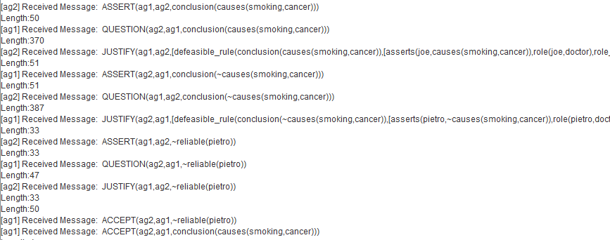
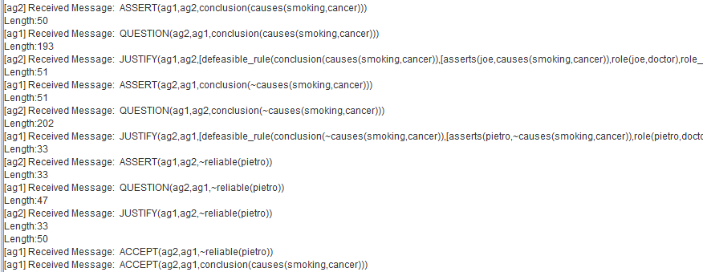

## Experimental Evaluation 

In this section, we show our results for the Enthymeme-based Communication Framework based on the scenario published in [2,3,4,5], 
describing the use of argumentation scheme from role to know. 

### Scenario - Role to Know

Considering the argumentation scheme **role to know** introduced in [2,3,4,5], imagine a scenario in which all agents know that `john` (an agent in the system) is playing the role of `doctor`--- `role(john,doctor)` --- within the organisational structure. Further, the agents know that doctors know about cancer --- `knows(doctor,cancer)`. Therefore, if `john` asserts that "*smoking causes cancer*" --- `asserts(john,causes(smoking,cancer))`, and causes of cancer are a subject matter related to cancer --- `about(causes(smoking,cancer),cancer)`, all agents are able to instantiate the argumentation scheme **role to know**, which allows them to conclude that smoking causes cancer: `causes(smoking,cancer)`.

Now, imagine that another agent also playing the role of doctor, called `pietro`, asserts that "*smoking does not cause cancer*", i.e., `asserts(pietro, ~causes(smoking,cancer))`. Any agent aware of both assertion, John's and Pietro's assertions, is able to construct conflicting arguments for `~causes(smoking,cancer)` and `causes(smoking,cancer)`, instantiating the argumentation scheme **role to know**, both arguments attacking (in conflict with) each other. 

However, the agents are able to question if `john` and `pietro` are honest (trustworthy, reliable) sources, if they really play the role of `doctor`, and the other questionable points indicated by critical questions in the argumentation scheme used. Thus, when the critical questions related to that scheme are not positively answered, that instance of argument might be not acceptable.

For example, if an agent has the information that "*Pietro is not a reliable source*", i.e., `~reliable(pietro)`, that agent is not able to answer positively the critical question `reliable(pietro)`, thus that instance of the argumentation scheme (i.e., that argument) might be not acceptable for that agent, i.e., the argument concluding  `~causes(smoking,cancer)` might be not an acceptable instance from the argumentation scheme **role to know**, while the argument concluding `causes(smoking,cancer)` might be an acceptable instance from **role to know**, supposing that agent knows that  `john` is reliable.

This dialogue is showed in the following output from Jason Platform, considering two agents ag1 and ag2:
_________________________

_________________________
The corresponding dialogue using Enthymemes for this dialogue, based on the implementation described in the paper, is showed below:
_________________________

_________________________

Note that, for this experiment, agents reduce the length of messages, when communicating enthymeme, in an average of 48% 
(45% the first argument, and 51% the second argument). Note that two premises of these arguments are organisational knowledge.

#### **Main Publications:**

[2] Panisson, Alison R. 
**Towards a Framework for Argumentation Schemes in Multi-Agent Systems.** 
In *3rd Summer School on Argumentation: Computational and Linguistic Perspectives*, 2018.

[3] Panisson, Alison R., Bordini, Rafael H. 
**Argumentation schemes in multi-agent systems: A social perspective**
In *International Workshop on Engineering Multi-Agent Systems*, pgs 92-108, 2017.

[4] Panisson, Alison R., Bordini, Rafael H. 
**Uttering only what is needed: Enthymemes in multi-agent systems**
In *16th Conference on Autonomous Agents and MultiAgent Systems*, pgs 1670-1672, 2017.

[5] Panisson, Alison R. 
**Argumentation schemes and enthymemes in multi-agent systems**
In *16th Conference on Autonomous Agents and MultiAgent Systems*, pgs 1849-1850, 2017.

